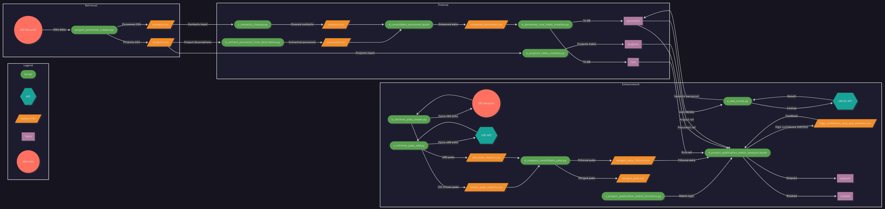

# Building an Analysis-Ready Data Resource Using a Multi-Stage Pipeline
## Project Information
- **Author**: Grace Donovan
- **Course**: MSDS 696 - Data Science Practicum II
- **Term**: 2025 Summer 8 Week 2

## Overview
This project builds a standardized relational database for the USGS Community for Data Integration (CDI), consolidating years of annual seed-funded project data into a unified, queryable schema. It extracts publicly available project information, then cleans, standardizes, and enriches the data by assigning unique identifiers to projects, personnel, and outputs, reconciling name variations in personnel records, and enriching the project data to include additional personnel ORCIDs and related publication data associated with each project.

## Directory Structure
```
msds-696/
├── 1_retrieval/
│   ├── data/
│   │   ├── contacts.csv
│   │   ├── crawler_state.pkl
│   │   ├── projects.csv
│   │   └── sitemap.txt
│   └── project_personnel_crawler.py
├── 2_cleanup/
│   ├── a_projects_table_creation.py
│   ├── b_extract_personnel_from_description.py
│   ├── c_contacts_cleanup.py
│   ├── d_consolidate_personnel.ipynb
│   ├── e_personnel_role_table_creation.py
│   └── data/
│       ├── contacts.csv
│       ├── cross_names.json
│       ├── enhanced_personnel.csv
│       └── personnel.csv
├── 3_enhance/
│   ├── a_add_orcids.py
│   ├── b_retrieve_pubs_known.py
│   ├── c_retrieve_pubs_xdd.py
│   ├── d_compare_consolidate_pubs.py
│   ├── e_project_publication_match_analysis.ipynb
│   ├── e_project_publication_match_functions.py
│   └── data/
│       ├── crawler_state.pkl
│       ├── high_confidence_proj_pub_matches.csv
│       ├── known_pubs_reports.csv
│       ├── merged_pubs.csv
│       ├── merged_pubs_filtered.csv
│       ├── sitemap.txt
│       └── xdd_pubs_reports.csv
├── .env
├── requirements.txt
└── README.md
```
## Database Entity–Relationship Diagram


## Pipeline Workflow Diagram



## Installation

### Prerequisites
- **Python 3.11+**
- **Google Chrome browser**
- **PostgreSQL database**

### Setup Steps
1. **Clone or download this repository**

2. **Install required packages:**
   ```bash
   pip install -r requirements.txt
   ```
3. **Ensure Google Chrome is installed** (for Selenium-based crawlers)

## Usage

The pipeline consists of three components that should be run in sequence:

### Retrieval

**Location:** `1_retrieval/`

#### 1.1 Project and Personnel Data Extraction
**Script:** `project_personnel_crawler.py`
- Scrape full-text content from CDI Project webpages
- Extract structured sections (title, year, description, and contacts)
- Write extracted data to CSV
- **Output:** `data/contacts.csv` and `data/projects.csv`

### Cleanup

**Location:** `2_cleanup/`

#### 2.1 Project Processing and Table Creation
**Script:** `a_projects_table_creation.py`
- Read raw scraped project data
- Clean and normalize descriptions
- Assign 12 character unique IDs to each unique project
- Extract top-5 keywords using KeyBERT from descriptions
- Bulk upsert project records into Postgres projects table
- **Input:** `1_retrieval/data/projects.csv`
- **Output:** `projects table`

#### 2.2 Extract Project Personnel from Descriptions
**Script:** `b_extract_personnel_from_description.py`
- Read raw scraped project data 
- Extract project personnel data from descriptions into lists using regex patterns
- Merge extracted lists into a single team string per project
- Explode single team string per project into one name per row
- Label first name for each project as "lead_pi" and the rest as "collab" 
- Clean up name strings to remove “PhD,” “Former Employee,” punctuation, and extra spaces
- Write resulting project_id, name, role table to CSV
- **Input:** `1_retrieval/data/projects.csv`
- **Output:** `data/personnel.csv`

#### 2.3 Cleanup Contacts
**Script:** `c_contacts_cleanup.py`
- Read raw scraped contacts data 
- Label each person per project_id as lead_pi (first) or collab (subsequent) via group-wise indexing
- Clean up name entries
- Write resulting project_id, name, title, organization, email, role to CSV
- **Input:** `1_retrieval/data/contacts.csv`
- **Output:** `data/contacts.csv`

#### 2.3 Consolidate Contact and Personnel Data
**Script:** `d_conslidate_personnel.ipynb`
- Read contacts and personnel data
- Fuzzy-match names within and across both sets to identify duplicates and near-matches
- Apply manual name fixes within individual sets
- Filter out exact matches and dump cross set alias map to JSON
- Manually correct names in JSON cross dump
- Reload JSON, use refined alias map to replaces names in both sets with corrected variants
- Outer-merge sets and cleanup merged dataframe values
- Write resulting project_id, name, title, organization, email, role to CSV
- **Input:** `data/contacts.csv` and `data/personnel.csv`
- **Intermediate Output:** `data/cross_names.json`
- **Output:** `data/enhanced_personnel.csv`

#### 2.4 Personnel Processing and Table Creation
**Script:** `e_personnel_role_table_creation.py`
- Read consolidated personnel data as a dataframe
- Assign each unique name a 12-character UUID as name_id
- Select one “representative” row per person (record with the most non-null title/organization/email)
- Filter dataframe by “representative” row per person
- Bulk upsert unique personnel data (name_id, name, title, organization, email) to personnel table
- Bulk upsert project–person–role mappings (project_id, name_id, role) to role table
- **Input:** `data/enhanced_personnel.csv`
- **Output:** `personnel table` and `role table`

### Enhance

**Location:** `3_enhance/`

#### 3.1 Retrieve Personnel ORCIDs via ORCID API
**Script:** `a_add_orcids.py`
- Read personnel table into a dataframe
- Call ORCID API for each name
- Verify middle names/initials to select best ORCID match
- Apply fuzzy-match threshold to drop low-confidence ORCIDs
- Alter personnel table to add an orcid column 
- Bulk-update each personnel table to add retrieved ORCID if available
- **Input:** `personnel table`
- **Output:** `personnel table`

#### 3.2 Retrieve Known Publications from CDI Website
**Script:** `b_retrieve_pubs_known.py`
- Scrape publication information table from CDI publication webpages
- Extract structured sections (title, year, doi, and authors)
- Write extracted data to CSV
- **Output:** `data/known_pubs_reports.csv`

#### 3.3 Retrieve CDI Publications from xDD API
**Script:** `c_retrieve_pubs_xdd.py`
- Call xDD snippets API with term/document filters
- Parse JSON response and skip any snippet with ≤ 2 hits
- Build records containing title, year, DOI, authors, highlight, and hits
- Dedupe records by DOI (or title if DOI is missing)
- Write unique records to CSV
- **Output:** `data/xdd_pubs_reports.csv`

#### 3.4 Consolidate Known and xDD Retrieved Publications
**Script:** `d_compare_consolidate_pubs.py`
- Read known publications data and xDD publications data as dataframes
- Parse and normalize xDD dataframe fields
- Outer-join dataframes on DOI and reorder columns
- Clean titles and authors entries
- Filter out annual/project/community facilitator reports using regex patterns in titles
- Write merged dataframe to CSV 
- Write filtered dataframe to CSV
- **Input:** `data/known_pubs_reports.csv` and `data/xdd_pubs_reports.csv`
- **Output:** `data/merged_pubs.csv` and `data/merged_pubs_filtered.csv`

#### 3.5 Matched Projects and Publications Analysis and Table Creation 
**Script and File:** `e_project_publication_match_functions.py` and `e_project_publication_match_analysis.ipynb`
- Load and join projects, role, and personnel tables via SQL into a dataframe
- Clean and align project and publication data
- Assign unique 12 character IDs to publications
- Compute weighted fuzzy-match score based on lead‐PI presence, author name similarity, keyword hits in the title, and year proximity
- Calculate summary statistics for weighted fuzzy-match scores
- Subset matches by high confidence matches (match_score >= 0.6) and save as CSV
- Manually check high confidence matches CSV, remove any matches that don't make sense
- Reload cleaned high confidence matches CSV as dataframe
- Subset dataframe by outputs (publication data) and related project/publication pairs
- Create outputs and related tables in database
- Bulk upsert outputs data to outputs table (output_id, title, doi, release_year)
- Bulk upsert related data to related table (output_id and project_id)
- **Input:** `data/merged_pubs_filtered.csv`, `projects table`, `role table`, `personnel table`, 
- **Intermediate Output:** `data/high_confidence_proj_pub_matches.csv`
- **Output:** `outputs table` and `related table`

## Key Features

### Web Scraping and Data Extraction
- **Multi-source Data**: Combines ORCID API and xDD API with web scraping for comprehensive data collection
- **Structured Content Extraction**: Automatically identifies and extracts key sections (title, description, contacts, etc.)
- **Error Handling**: Logs failed attempts and continues processing
- **Selenium Integration**: Uses Chrome WebDriver for dynamic content extraction

### Identity and Provenance
- **UUID Assignment**: Generates unique 12-character identifiers for distinct entities, ensuring reliable joins and deduplication.
- **Column Renaming**: Renames author and metadata columns to generic field names (person, pub_authors) for uniform downstream processing.

### Project/Publication Match Filtering, Scoring, and Reporting
- **Year-Window Filtering**: Selects publications within a tolerance window around each project’s start year to focus on relevant outputs.
- **Fuzzy Author Matching**: Applies rapid fuzz token_sort_ratio with lead-PI enforcement to quantify author overlap and ensure key contributors are present as publication authors.
- **Keyword-in-Title Matching**: Uses rapid fuzz partial_ratio to score the presence of project keywords in publication titles.
- **Statistical Summarization**: Calculates mean, median, mode, minimum, and maximum of match scores for quick performance insights.
- **Weighted Scoring Engine**: Combines normalized year proximity, author similarity, and keyword hits into a single match score with adjustable weights and thresholds.
   
### SQL-Based Table Creation, Data Upsert, and Data Ingest
- **Automated Outputs Table Creation**: Creates tables in Postgres database, ensuring reproducible persistence of results.
- **PostgreSQL Integration**: Uses psycopg2 with context-managed cursors for efficient querying and joins across tables.

## Configuration

### Data Retrieval Settings
- **Web Scraping**: Selenium Chrome WebDriver set to avoid rate limit errors using page load delays and human like waits (3-7 seconds between page visits).
- **xDD API**: Search term “community for data integration”, minimum publication date set to 2009-01, filter by presence of “USGS”, result limit set to 1000 snippets
- **ORCID API**: Search by given‐names (first) and family‐name (last), set max results per query to 4, and set rate limit to 1 second pause between calls.

### Data Cleaning and Extraction
- **Project Descriptions**: Truncate at firs instances of “Principal” in description and collapse all newlines to single spaces then trim.
- **Keyword Extraction**: KeyBERT (all-MiniLM-L6-v2) for identify top 5 unigram keywords from descriptions
- **Personnel Parsing**: Regex to identify "Principal Investigator", "Co-Investigator(s)", "Cooperator/Partner" instances in descriptions. Clean name labels used to remove “PhD”, “Contractor”, “Former Employee”, stray punctuation.

### Matching and Scoring
- **Year Window**: Publications released >=4 years around each project’s start.
- **Author Matching**: Fuzzy match threshold set to 70% (token_sort_ratio) and enforced presence of the lead PI name in the publication author list.
- **Keyword Matching**: Fuzzy match threshold for project keywords in publication titles set to 70% (partial_ratio)
- **Score Weights**: Year proximity weight set to 0.4, author overlap weight set to 0.2, and keyword hits weight set to 0.4.

### Database Connection
- **Environment Variable**: DATABASE_DSN in .env
- **Auto-Created Tables**: Outputs and related tables creation
- **Upsert Method**: Bulk inserts/updates via psycopg2’s execute_values

## Output Files
| File Path | Description | Component |
|-----------|-------------|-----------|
| `1_retrieval/data/contacts.csv` | Raw contact information scraped from CDI project pages | Data Retrieval |
| `1_retrieval/data/projects.csv` | Raw project metadata scraped from CDI project pages | Data Retrieval |
| `1_retrieval/data/crawler_state.pkl` | Serialized crawler state for resumable scraping sessions | Data Retrieval |
| `1_retrieval/data/sitemap.txt` | List of CDI project URLs to crawl | Data Retrieval |
| `2_cleanup/data/personnel.csv` | Personnel extracted from project descriptions | Data Processing |
| `2_cleanup/data/contacts.csv` | Cleaned project contact records | Data Processing |
| `2_cleanup/data/cross_names.json` | Manual alias mappings for name reconciliation | Data Processing |
| `2_cleanup/data/enhanced_personnel.csv` | Consolidated and deduplicated personnel dataset | Data Processing |
| `3_enhance/data/known_pubs_reports.csv` | Publication metadata scraped from CDI publication pages | Data Enhancement |
| `3_enhance/data/xdd_pubs_reports.csv` | Publication metadata retrieved via xDD API | Data Enhancement |
| `3_enhance/data/merged_pubs.csv` | Combined known and xDD publication dataset | Data Enhancement |
| `3_enhance/data/merged_pubs_filtered.csv` | Filtered publication dataset excluding non-project/community reports | Data Enhancement |
| `3_enhance/data/high_confidence_proj_pub_matches.csv` | High-confidence project–publication match list for review | Data Enhancement |

## Database Tables
| Table Name | Description | Component |
|-----------|-------------|-----------|
| `projects` | Cleaned and normalized project metadata with unique IDs, descriptions, years, and extracted keywords | Data Processing
| `personnel` | Unique personnel records enriched with titles, organizations, emails, and ORCIDs | Data Processing
| `role` | Project–personnel role mappings, linking project_id to name_id with role labels (lead_pi, collab) | Data Processing
| `outputs` | Unique publication outputs with assigned IDs, titles, DOIs, and release years | Data Enhancement
| `related` | Relationships between projects and publication outputs (project_id, output_id) | Data Enhancement

## Limitations

### Technical Limitations
1. **Web Scraping Fragility**: Changes to the CDI website’s HTML structure or anti-bot defenses can break the Selenium crawler and lead to data gaps.
2. **API Coverage and Accuracy**: ORCID and xDD API responses vary in completeness and may return low-confidence or missing matches, impacting enrichment quality.
3. **Heuristic Matching Errors**: Fuzzy-matching thresholds for personnel names and publication keywords can produce false positives or overlook valid links, requiring manual review.
4. **Processing Environment Dependencies**: Requires a compatible Chrome WebDriver, stable internet access, and PostgreSQL.

### Scope Limitations
1. **Temporal Scope**: Limited to projects and outputs available on the CDI website from 2013 onward because the CDI website only includes 2013+ project information. However, the annual request for proposals effort began in 2009 so older project data is not included.
2. **Public Data Availability**: Relies exclusively on publicly accessible records where internal reports and restricted data are not captured.
3. **Schema Constraints**: Fixed PostgreSQL schema may not accommodate future data types without refactoring.

